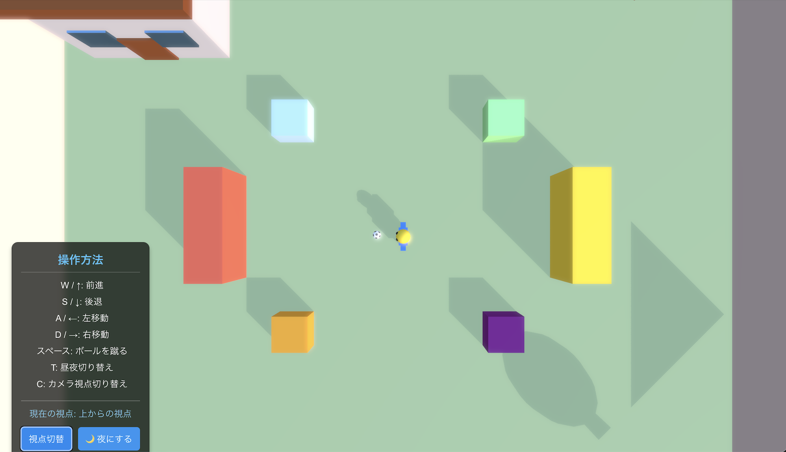
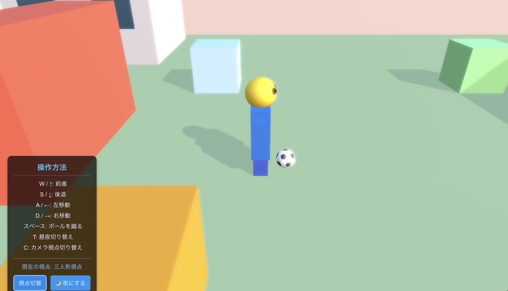
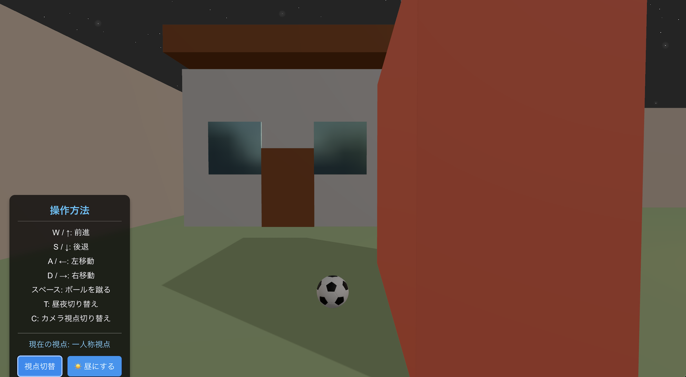

# Meta-Space

React、Three.js、React Three Fiberで構築された仮想3D環境です。

## スクリーンショット

ゲーム内のスクリーンショットです：







## 概要

Meta-Spaceは、ユーザーがデジタル空間を探索し、インタラクションできる3D仮想環境です。最新のWeb技術を使用して構築されており、ブラウザ上で没入型の体験を提供します。

## 使用技術

- React 19
- Three.js
- React Three Fiber
- React Three Drei
- TypeScript
- Vite

## 始め方

### 必要条件

- Node.js（最新のLTSバージョン推奨）
- npm または yarn

### インストール

1. リポジトリをクローンする
```bash
git clone [repository-url]
cd meta-space
```

2. 依存関係をインストールする
```bash
npm install
# または
yarn
```

3. 開発サーバーを起動する
```bash
npm run dev
# または
yarn dev
```

4. ブラウザを開いて `http://localhost:5173` にアクセスする

## 本番用ビルド

```bash
npm run build
# または
yarn build
```

ビルド成果物は `dist/` ディレクトリに格納されます。

## ライセンス

[MIT](https://choosealicense.com/licenses/mit/)
